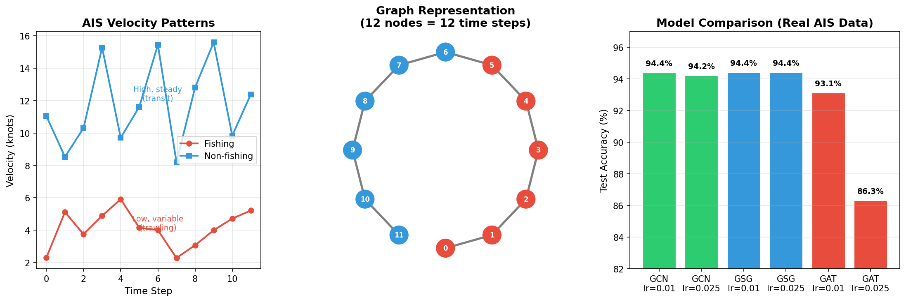
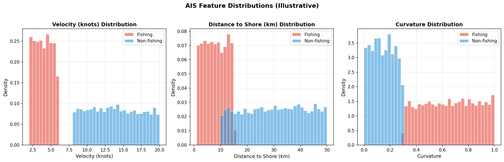
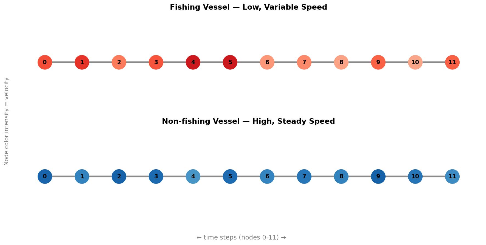
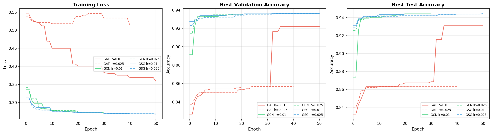

# Graph-Based Classification of AIS Time-Series Data

**NAIC Use Case 5 (UC5)** — Graph Neural Networks for maritime vessel activity classification



> **Key Finding:** GraphSAGE achieved **94.4% test accuracy** on fishing vs. non-fishing
> classification from AIS time-series data, outperforming both GCN and GAT architectures.

## Overview

This demonstrator uses Graph Neural Networks (GNNs) to classify vessel activities
from Automatic Identification System (AIS) time-series data. AIS broadcasts
vessel information — position, speed, heading, course — enabling maritime
monitoring and behavior analysis.

Each time-series consists of **12 observations** with **3 features** (velocity,
distance to shore, curvature). These are transformed into graph structures where
nodes represent time steps and edges connect consecutive observations, allowing
GNNs to learn complex temporal and spatial patterns.

### Why Graphs?

Traditional ML approaches treat AIS data as flat feature vectors, losing the
sequential structure. By representing each trajectory as a graph:

- **Temporal ordering** is preserved through sequential edges
- **Message passing** aggregates information across time steps
- **Self-loops** ensure each node retains its own features
- **Graph-level readout** produces a single classification per trajectory

## Sample Results

### Feature Distributions

Fishing vessels exhibit distinct patterns: lower speeds, proximity to shore,
and frequent course changes (high curvature). Ranges shown are based on
the documented AIS feature characteristics.



### Graph Representation

Each AIS time-series becomes a 12-node chain graph. Node colors indicate
velocity — fishing vessels show lower, more variable speeds.



### Model Comparison

Three GNN architectures trained on 14,100 graphs, validated on 4,700,
tested on 4,700:

| Model | Type | Params | Test Accuracy (lr=0.01) | Test Accuracy (lr=0.025) |
|-------|------|:------:|:----------------------:|:------------------------:|
| GCN | Graph Convolutional Network | 8,832 | 94.4% | 94.2% |
| **GraphSAGE (GSG)** | **Sample and Aggregate** | **17,216** | **94.4%** | **94.4%** |
| GAT | Graph Attention Network | 13,248 | 93.1% | 86.3% |

GraphSAGE delivers the most **consistent performance** across learning rates,
while GAT shows higher sensitivity to hyperparameters.

### Training Curves



## Quick Start

### Option A: Automated Setup (recommended)

```bash
git clone https://github.com/NAICNO/wp7-UC5-ais-classification-gnn.git
cd graph-based-classification-of-ais-time-series-data
chmod +x setup.sh
./setup.sh
source venv/bin/activate
```

### Option B: Manual Setup

```bash
python -m venv venv
source venv/bin/activate

# CPU only:
pip install torch==2.4.0 --index-url https://download.pytorch.org/whl/cpu
pip install dgl==2.4.0 -f https://data.dgl.ai/wheels/torch-2.4/repo.html

# GPU (CUDA 11.8):
pip install torch==2.4.0 --index-url https://download.pytorch.org/whl/cu118
pip install dgl==2.4.0+cu118 -f https://data.dgl.ai/wheels/torch-2.4/cu118/repo.html

pip install -r requirements.txt
pip install -e .
```

### Run the Demonstrator

```bash
# Jupyter notebook (self-contained, uses synthetic data)
jupyter lab  # open demonstrator-v1.orchestrator.ipynb

# With real AIS data
export PYTHONPATH=$PYTHONPATH:$(pwd)/src
python src/graph_classification/train_graph_classification_ais.py \
    --data_folder data/ --model_path results/ --epochs 100 --patience 20
```

### Run Tests

```bash
pytest tests/ -v  # 104 tests, 82% coverage
```

## Methodology

### Data Pipeline

```
AIS Time-Series (N, 3, 12)
        │
        ▼
┌─────────────────────┐
│ Graph Construction   │  12 nodes (time steps)
│ Sequential edges     │  11 edges + 12 self-loops
│ Node features (12,3) │  velocity, shore dist, curvature
└─────────────────────┘
        │
        ▼
┌─────────────────────┐
│ GNN Backbone         │  GCN / GraphSAGE / GAT
│ Multiple layers      │  with batch normalization
└─────────────────────┘
        │
        ▼
┌─────────────────────┐
│ Graph Readout        │  Mean pooling over nodes
│ Classification Head  │  → fishing / non-fishing
└─────────────────────┘
```

### AIS Features

| Feature | Description | Fishing Pattern | Transit Pattern |
|---------|-------------|-----------------|-----------------|
| **Velocity** | Speed over ground | Low, variable (2-6 kn) | High, steady (8-20 kn) |
| **Distance to shore** | Proximity to coast | Close (1-15 km) | Far (10-50 km) |
| **Curvature** | Rate of course change | High (frequent turns) | Low (straight lines) |

### GNN Architectures

**GCN** (Graph Convolutional Network) — Extends spectral convolutions to graphs.
Each layer aggregates features from neighbors using a normalized Laplacian.
Simple and effective for fixed-structure graphs.

**GraphSAGE** (Sample and Aggregate) — Learns by sampling and aggregating
neighborhood features using a mean function. Supports inductive learning and
scales to large, dynamic graphs.

**GAT** (Graph Attention Network) — Uses multi-head attention to weight
neighbor importance. More expressive but sensitive to hyperparameters on
simple graph structures.

### Training Configuration

| Parameter | Value | Description |
|-----------|-------|-------------|
| Epochs | 1000 (max) | With early stopping |
| Patience | 200 | Epochs without validation improvement |
| Batch size | 600 | Graphs per batch |
| Learning rates | 0.01, 0.025, 0.05 | Swept per model |
| Hidden dim | 32-64 | Model-dependent |
| Depth | 3 | GNN layers |
| Optimizer | Adam | Default parameters |

### Dataset

| Split | Samples | Purpose |
|-------|---------|---------|
| Training | 14,100 | Model training |
| Validation | 4,700 | Early stopping, hyperparameter tuning |
| Test | 4,700 | Final evaluation |
| **Total** | **23,500** | Binary classification (fishing / non-fishing) |

## Project Structure

```
graph-based-classification-of-ais-time-series-data/
├── README.md                       # This file
├── LICENSE                         # CC BY-NC 4.0 (content) + GPL-3.0 (code)
├── AGENT.md                        # AI agent setup instructions
├── AGENT.yaml                      # Machine-readable agent config
├── setup.sh                        # Automated environment setup
├── vm-init.sh                      # One-time VM initialization
├── pyproject.toml                  # Package configuration
├── requirements.txt                # Python dependencies
├── requirements-docs.txt           # Sphinx documentation dependencies
├── pytest.ini                      # Test configuration
├── widgets.py                      # Jupyter ipywidgets
├── utils.py                        # Cluster SSH/SLURM utilities
├── Makefile                        # Sphinx build
├── .github/workflows/           # CI + Pages workflows
├── demonstrator-v1.orchestrator.ipynb  # Self-contained demo (synthetic data)
├── notebooks/
│   └── DGL_Demonstrator.ipynb      # Original notebook (requires real data)
├── src/graph_classification/       # Source code
│   ├── models.py                   # GCN, GAT, GraphSAGE architectures
│   ├── heads.py                    # Node & graph classification heads
│   ├── ais_timeseries_dataset.py   # DGL dataset class
│   ├── utils.py                    # Laplacian, data split, training utils
│   ├── train_graph_classification_ais.py  # Training pipeline + CLI
│   └── eval_graph_classification_ais.py   # Model evaluation + CLI
├── tests/                          # 104 tests, 82% coverage
├── scripts/
│   └── generate_images.py          # Generate result plots for docs
├── results/                        # Trained model outputs (.pt, .json)
├── content/                        # Sphinx documentation
│   ├── conf.py
│   ├── index.rst
│   ├── episodes/                   # 7 tutorial episodes
│   │   └── snippets/               # Reusable code examples
│   └── images/                     # Result visualizations
│       ├── gnn_hero.png            # Pipeline overview
│       ├── feature_comparison.png  # Feature distributions
│       ├── graph_structure.png     # Graph visualization
│       └── training_curves.png     # Loss & accuracy plots
└── data/                           # AIS dataset (not in repo)
    ├── X_ts12.npy                  # Features (N, 3, 12)
    ├── y_ts12.npy                  # Labels (N,)
    └── bidx_ts12.npy               # Bootstrap split indices (50 folds)
```

## CLI Reference

```bash
# Training — sweep models and learning rates
python src/graph_classification/train_graph_classification_ais.py \
    --data_folder data/ \
    --model_path results/ \
    --models "GCN, GSG, GAT" \
    --lrs "5e-2, 3e-2, 1e-2" \
    --epochs 1000 \
    --hidden 32 \
    --batch_size 600 \
    --patience 200

# Quick test — few epochs, verify setup
python src/graph_classification/train_graph_classification_ais.py \
    --data_folder data/ --epochs 10 --patience 5

# Evaluation — load saved models and test
python src/graph_classification/eval_graph_classification_ais.py \
    --data_folder data/ --model_path results/ --batch_size 4000

# Generate documentation images
python scripts/generate_images.py
```

## NAIC Orchestrator VM Deployment

For deployment on NAIC VMs, see [AGENT.md](AGENT.md) for step-by-step instructions
including SSH access, VM initialization, and Jupyter tunnel setup.

```bash
# One-time VM setup
./vm-init.sh

# Project setup
./setup.sh
source venv/bin/activate

# Start Jupyter with SSH tunnel
jupyter lab --no-browser --ip=0.0.0.0 --port=8888

# On your laptop:
ssh -N -L 8888:localhost:8888 -i ~/.ssh/naic-vm.pem ubuntu@<VM_IP>
```

## Documentation

Full tutorial documentation is built with Sphinx and deployed to GitLab Pages:

```bash
pip install -r requirements-docs.txt
make html  # output in build/html/
```

The tutorial covers 7 episodes:
1. Introduction to AIS graph classification
2. Provisioning a VM on NAIC Orchestrator
3. Setting up the environment
4. GNN theory (GCN, GraphSAGE, GAT)
5. AIS data and graph construction
6. Running the demonstrator
7. FAQ and troubleshooting

## Authors

- **Xue-Cheng Tai** — NORCE Norwegian Research Centre (xtai@norceresearch.no)
- **Gro Fonnes** — NORCE Norwegian Research Centre (grfo@norceresearch.no)

## License

- Tutorial content (`content/`, `*.md`, `*.ipynb`): [CC BY-NC 4.0](https://creativecommons.org/licenses/by-nc/4.0/)
- Software code (`*.py`, `*.sh`): [GPL-3.0](https://www.gnu.org/licenses/gpl-3.0.html)

## References

- [Deep Graph Library (DGL)](https://www.dgl.ai/)
- [NAIC Project](https://naic.no)
- [Sigma2 / NRIS](https://www.sigma2.no)
- Kipf & Welling, "Semi-Supervised Classification with Graph Convolutional Networks" (ICLR 2017)
- Hamilton et al., "Inductive Representation Learning on Large Graphs" (NeurIPS 2017)
- Veličković et al., "Graph Attention Networks" (ICLR 2018)
